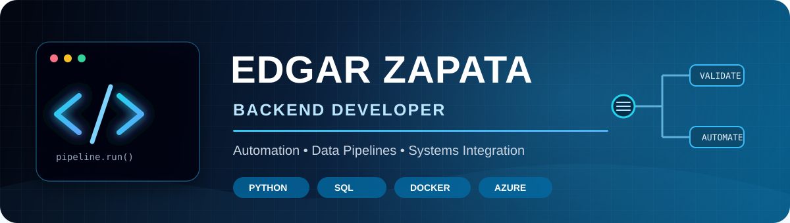

I build reliable backend systems, data pipelines, and workflow automations that turn complex processes into maintainable software.

## About Me

- Backend Developer at **PexeLink**, building real-time XML ingestion and validation pipelines
- B.S. in Computer Science from **Midwestern State University**, May 2026
- Former **Comcast Enterprise Data Analytics Intern**, where I cleaned and transformed more than 3 million records using Teradata SQL and Python
- Former **System Engineer at Pierce Arrow**, creating event-driven approval workflows and integrations across Microsoft Teams, SharePoint, and email
- First-place recipient at the **20th MSU Texas Undergraduate Research Forum** for machine-learning financial analysis
- Based in Wichita Falls, Texas, and open to backend, automation, data engineering, and software engineering opportunities

## Engineering Approach

| Reliable Systems | Clean Data | Useful Automation |
| --- | --- | --- |
| I design for predictable behavior, clear failure states, and maintainable code. | I validate inputs, preserve meaning, and make bad records visible instead of silently dropping them. | I automate repetitive work so teams can focus on decisions rather than manual processing. |

## What I Work With

**Backend & Automation**

**Data & Databases**

**Systems & Tools**

## Professional Highlights

| Experience | Impact |
| --- | --- |
| **PexeLink — Backend Developer** | Built automated XML ingestion with real-time processing and validation; designed a multi-table PocketBase backend on Raspberry Pi edge devices. |
| **Comcast — Enterprise Data Analytics Intern** | Cleaned and transformed 3M+ enterprise records with Teradata SQL and investigated anomalies with Python and Pandas. |
| **Pierce Arrow — System Engineer** | Built state-tracked approval automation and integrated Teams, SharePoint, email, and calendar workflows. |
| **Independent PC Repair & Resale** | Diagnosed, repaired, upgraded, tested, and resold gaming PCs, generating approximately $1,200 in profit. |

## Education, Awards & Certifications

- **B.S. Computer Science**, Midwestern State University — May 2026
- **1st Place**, 20th MSU Texas Undergraduate Research Forum — Machine-Learning Financial Analysis
- **Intermediate Cybersecurity**, CodePath — 2023
- **Technical Interview Prep**, CodePath — 2023

## Featured Projects

| Project | What it demonstrates | Technology |
| --- | --- | --- |
| [**Emotion Logs**](https://github.com/ezapez/emotion-logs) | Records moods and helps users identify emotional patterns over time. | `Python` |
| [**AnalytiZap**](https://github.com/ezapez/AnalytiZap) | Explores portfolio analysis for cryptocurrency and stock data. | `Data Analysis` `Finance` |
| [**Weather App**](https://github.com/ezapez/weather-app) | Retrieves and presents weather information through a web interface. | `Python` `Flask` `HTML` |
| [**QuizMe**](https://github.com/ezapez/quizme-flutterapp) | Provides a teacher interface for creating and managing quizzes. | `Flutter` `Dart` |

> **In progress:** A production-style customer data pipeline with validation, quarantine reporting, deterministic deduplication, and Type 2 slowly changing history.

## Current Focus

- Building Python automation and data-analysis projects that demonstrate practical engineering skills
- Strengthening data modeling, pipeline reliability, deterministic processing, and test coverage

## GitHub Activity

## Let's Connect

I am interested in opportunities where I can contribute to backend development, automation, data pipelines, systems integration, or analytics. Reach me through [LinkedIn](https://www.linkedin.com/in/edgarmzapata54/).
